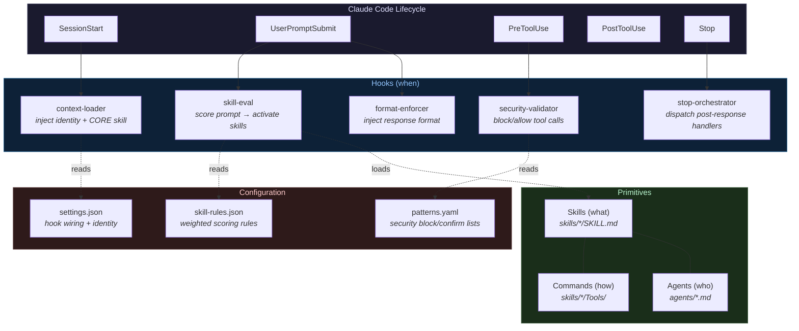

# Captain Hooks

[](https://github.com/Esk3nder/captain-hooks/actions/workflows/ci.yml)
[](LICENSE)

A minimal, forkable framework for Claude Code infrastructure — skills, hooks, agents, and commands that compose naturally.

Born from studying two production Claude Code repos ([diet103/claude-code-infrastructure-showcase](https://github.com/diet103/claude-code-infrastructure-showcase) and [ChrisWiles/claude-code-showcase](https://github.com/ChrisWiles/claude-code-showcase)), Captain Hooks extracts the best patterns from both into a zero-opinion starter template.

## What You Get

```
captain-hooks/
├── CLAUDE.md                    # Fill-in template for your project
├── CUSTOMIZE.md                 # 5-step fork-and-go guide
├── settings.json                # All hooks pre-wired
├── hooks/                       # Lifecycle event handlers
│   ├── skill-eval.hook.ts       # Weighted skill activation engine
│   ├── context-loader.hook.ts   # Session identity + context injection
│   ├── security-validator.hook.ts # Command/path safety validation
│   ├── format-enforcer.hook.ts  # Response format reminder
│   ├── stop-orchestrator.hook.ts # Post-response handler distribution
│   └── lib/                     # Shared utilities (stdin, paths, logging)
├── skills/
│   ├── skill-rules.json         # Unified activation rules (weighted scoring)
│   ├── skill-rules.schema.json  # JSON Schema for validation
│   ├── CORE/                    # Identity, stack prefs, response format
│   ├── CreateSkill/             # Meta-skill: teaches extending the framework
│   └── _ExampleNotes/           # Working example (delete after studying)
├── agents/                      # Agent definitions with model tier guidance
├── security/patterns.yaml       # Customizable security patterns
└── scripts/validate-skills.ts   # Validate all skills against schema
```

## How It Works



**The flow:** Claude Code fires lifecycle events → hooks react by reading config and injecting context → skills, agents, and commands compose through the `<system-reminder>` context bus. No primitive imports another.

## Philosophy

**Four composable primitives:**

| Primitive | Defines | Lives In |
|-----------|---------|----------|
| **Skill** | *What* to do (capabilities + workflows) | `skills/` |
| **Hook** | *When* to do it (lifecycle reactions) | `hooks/` |
| **Agent** | *Who* does it (personas + model tiers) | `agents/` |
| **Command** | *How* to do it (automation scripts) | `skills/*/Tools/` |

They compose through Claude Code's `<system-reminder>` context bus — no primitive imports another.

## Quick Start

```bash
# 1. Fork this repo
gh repo fork Esk3nder/captain-hooks --clone

# 2. Install hook dependencies
cd captain-hooks && bun install

# 3. Personalize (edit identity + fill in template)
$EDITOR settings.json CLAUDE.md

# 4. Delete the example skill
rm -rf skills/_ExampleNotes

# 5. Create your first skill
# Just ask Claude: "Create a skill for <your use case>"
```

See [CUSTOMIZE.md](CUSTOMIZE.md) for the full fork-and-go guide.

## Key Innovations

### Unified Skill Activation (from both source repos)

`skill-rules.json` merges two production-tested approaches:
- **Type/enforcement/priority** (diet103) — classify skills as proactive/reactive/guard with suggest/inject/require enforcement
- **Weighted multi-factor scoring** (ChrisWiles) — keyword, pattern, directory, intent, filePath, and content dimensions with configurable weights and thresholds

### Hook Lifecycle Contracts

Every hook type has a documented contract: what it receives via stdin, what it outputs to stdout, exit codes, and timing expectations. See `hooks/README.md`.

### Progressive Disclosure

Skills follow a 500-line rule: SKILL.md provides routing and quick reference, Workflows/ contains execution procedures, Tools/ contains automation. Context window is treated as the scarcest resource.

### Self-Extending

The `CreateSkill` meta-skill teaches you how to create more skills following the exact same pattern. The framework grows without degrading.

## Glossary

| Term | Definition |
|------|-----------|
| **Skill** | A capability with a SKILL.md entry point, optional Workflows/ and Tools/ subdirectories. Skills define *what* the AI can do. |
| **Hook** | A TypeScript script triggered by Claude Code lifecycle events (SessionStart, UserPromptSubmit, PreToolUse, PostToolUse, Stop, etc.). Hooks define *when* things happen. |
| **Agent** | A persona definition with model tier guidance. Agents define *who* handles a task (e.g., reviewer, researcher). |
| **Command** | An automation script in `skills/*/Tools/`. Commands define *how* specific operations execute. |
| **Trigger** | A condition in `skill-rules.json` that activates a skill (keywords, patterns, intents, directories, file types). |
| **Enforcement** | How a matched skill is presented: `suggest` (hint), `inject` (auto-load SKILL.md), `require` (must acknowledge). |
| **Handler** | A Stop-phase script in `hooks/handlers/` auto-discovered by the stop-orchestrator. |
| **Progressive Disclosure** | Pattern where SKILL.md stays under 500 lines; details live in Workflows/ and Tools/. |

## Requirements

- [Claude Code](https://docs.anthropic.com/en/docs/claude-code) CLI
- [Bun](https://bun.sh) runtime (for hooks)

## Credits

Patterns extracted from:
- [diet103/claude-code-infrastructure-showcase](https://github.com/diet103/claude-code-infrastructure-showcase) — skill activation architecture, progressive disclosure, session state
- [ChrisWiles/claude-code-showcase](https://github.com/ChrisWiles/claude-code-showcase) — weighted scoring, JSON schema, multi-model agents, CI/CD patterns

## License

MIT
